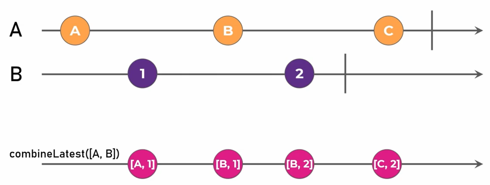

## 使用创建操作符创建可观察对象

- **ajax**

  用于获取从api返回的数据。

  ```
  const $ajax = ajax('http://localhost:3000/personalized');
  返回一个响应对象。
  const $jsonAjax = ajax.getJSON('http://localhost:3000/personalized');
  返回响应对象的response数据
  
  // 把一个对象作为参数
  ajax({
  	url: 'http://localhost:3000/personalized',
    	method: 'post',
    	headers: {
      	'Content-Type': 'application/json',
      	'rxjs-custom-header': 'Rxjs'
  	},
      body: {
          rxjs: 'Hello World!'
  	}
  })
  ```

- **of**

  传入一组参数，每个参数都将成为一个next通知

  ```
  import { of } from 'rxjs';
  of<number[]>(1, 2, 3, 4, 5, 6).subscribe(val => console.log(val));
  参数通知完毕会调用complete方法
  of(1, 2, 3, 4, 5, 6).subscribe({
  	next: (val) => console.log(val),
  	complete: () => console.log('complete')
  });
  ```

- **from**

  传入一个数组、promise、Observable。

  ```
  import { from, of } from 'rxjs';
  const obser = {
  	next: val => console.log(val),
  	complete: () => console.log('complete'),
  	error: (error) => console.error(error)
  }
  from([1,2,3,5,8,9]).subscribe(obser);
  from(of(1,2,3,5,8,9,10)).subscribe(obser);
  from(new Primise((res, rej) => {
  	setTimeout(() => {
  		// next 接收res数据，error接收rej数据
  		res('111');
  		// rej('error');
  	}, 2000)
  }))
  ```

- **fromEvent**

  可以用于为`dom`元素添加事件。

  ```
  import { fromEvent } from 'rxjs';
  const button = document.querySelector('button');
  const subscribetion = fromEvent(button, 'click').subscribe(event => {
  	console.log(event.type, event.x, event.y)
  })
  setTimeout(() => {
  	// 在取消订阅的同时也会移除事件监听
  	subscribetion.unsubscribe();
  }, 3000)
  // 用Observable表示
  const observable = new Observable<MouseEvent>((obser) => {
  	cosnt eventFun = function (event) {
  		console.log('...');
  		obser.next(event);
  	}
  	button.addEventListener('click', eventFun);
  	return () => {
  		button.removeEventListener('click', eventFun);
  	}
  })
  const subscribetion = fromEvent(button, 'click').subscribe(event => {
  	console.log(event.type, event.x, event.y)
  })
  setTimeout(() => {
  	subscribetion.unsubscribe();
  }, 3000)
  ```

- **range**

  返回一个范围的数字

  ```
  range(5(start), 10(count)).sucscribe(val => console.log(val));  => [5, 15)
  range(5).sucscribe(val => console.log(val));  => [0, 5)
  ```

- **timer**

  几秒后返回一个数字0。这是一个cold的observable

  ```
  import { timer } form 'rxjs'
  const subscribetion = timer(3000).subscribe({
  	next: val => console.log(val),
  	complete: () => console.log('complete')
  })
  setTimeout(() => {
  	在返回数字之前取消订阅会清除定时器
  	subscribetion.unsubscribe()
  }, 1000)
  // 传入第二个参数，会在返回第一个数之后变为setInterval形式
  const subscribetion = timer(3000, 2000).subscribe({
  	next: val => console.log(val),
  	complete: () => console.log('complete')
  })
  3秒返回0后，每2秒返回一个累加的数
  ```

- **interval**

  每隔几秒返回一个累加的数字。也是一个cold的Observable；

  ```
  import { interval } from 'rxjs'
  interval(2000).subscribe(val => {
  	console.log(val)
  })
  ```

- **forkJoin**

  传入一个由`Observable`组成的数组，在所有`Observable`完成时返回`Observable`传递的数据。

  对于返回多个数据的`Observable`，只返回最有一个数据。

  返回一个数组，数组每一项为传入的`Observable`的数据。

  ```
  forkJoin([
      ajax('/api/playlist/track/all?id=2420291699&limit=30'),
      ajax('/api/playlist/track/all?id=7101776910&limit=30')
  ]).subscribe(([{response: responseA}, {response: responseB}]) => {
      console.log(responseA);
      console.log(responseB);
  })
  
  forkJoin([
  	from([0,1,2,3,4,5,6,7,8,9]),
  	from([10,11,12,13,14,15,16,17,18,19])
  ]).subscribe(val => {
  	console.log(val);  => [9, 19]
  })
  ```

  如果有一个`Observable`出行错误，`forkJoin`只会执行error

  ```
  forkJoin([
      ajax('/api/playlist/track/all?id=2420291699&limit=30'),
      ajax('/api/playlist')
  ]).subscribe({
      next: ([{response: responseA}, {response: responseB}]) => {
          console.log(responseA);
          console.log(responseB);
      },
      error: error => console.log(error),
      complete: () => console.log('complete')
  })
  ```

- **combineLatest**

  和`forkJoin`类似，都是传入一个`Observable`数组，但`combinelatest`是持续返回数据的。返回数据方式如下。



```
// 例
<div>
    <input type="text" class="form-control" id="ipt" />
    <div>
        <select name="" id="set">
            <option value=""></option>
            <option value="摄氏度">摄氏度</option>
            <option value="华氏度">华氏度</option>
        </select>
    </div>
</div>
// 
import { combineLatest, fromEvent } from 'rxjs';

const ipt = document.querySelector('input[type=text]');
const set = document.querySelector('select');
// 每次输入框或下拉框改变时，都会输入本次修改的表单的value加上另一个表单上次修改的value
combineLatest([
	fromEvent(ipt, 'input'), 
	fromEvent(set, 'input')
]).subscribe(
  ([inputEvent, selectEvent]) => {
    const num = inputEvent.target['value'];
    const type = selectEvent.target['value'];
    console.log(`${num}${type}`);
  }
);

```

